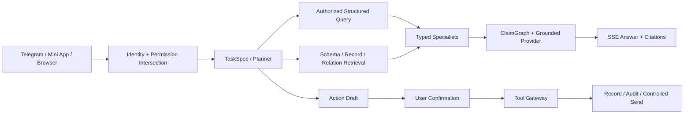

# Telegram Bitable Work Agent

> Telegram-first 多维表格、无代码工作区与表格绑定 Digital Employee 平台。当前仓库包含 Stage12 Quality Architecture V2 的完整本地源码；生产回答权仍由 Stage11/r76 承担，Stage12 默认关闭且尚未完成真实服务器发布验收。

本项目以多维表格为产品底座：Workspace、Base、Table、Field、Record、View、Permission、Draft 与 Audit 共同定义业务事实和执行边界。Telegram 是主要入口，React Mini App 和浏览器工作台提供表格配置、确认与审计界面。Digital Employee 只能在调用者权限、Agent 配置范围和 Telegram 会话范围的交集内工作。

## 核心能力

- 通用多维表格：类型化字段、JSONB 记录、关联记录、视图、表单与权限控制。
- AI 对话工作台：受控 SSE、持久化 run、状态恢复、引用与结构化结果投影。
- Quality Architecture V2：`TaskSpec`、授权 Query Engine、三层索引、typed Specialist、Grounded Provider 和 durable Action。
- 受控执行：Agent 先生成 draft，经用户确认后由 Tool Gateway 落地并写入 Audit。
- 原生服务器部署：Nginx、systemd、FastAPI、PostgreSQL/pgvector 与 Redis，不采用容器化生产部署。

## 架构原则



> 表格事实由结构化查询引擎计算；Embedding 负责发现候选；LLM 负责理解歧义、分析和表达；Agent 负责协调；Tool Gateway 负责受控落地。

Stage12 不会把 embedding 相似度当作 Join、Count 或 Group By 的计算结果，也不会把 deterministic fallback 计作真实模型质量通过。详细架构见 [Stage12 Quality Architecture V2](project-docs/02-architecture/stage12-quality-v2/README.md)。

## 技术栈

| Layer | Technology |
| --- | --- |
| Backend | Python 3.12+, FastAPI, SQLAlchemy 2.x, Alembic |
| Data | PostgreSQL, JSONB, pgvector |
| Queue / Cache | Redis |
| Agent | LangGraph-first, OpenAI-compatible provider gateway |
| Frontend | React, Vite, TypeScript, Tailwind CSS |
| Entry | Telegram Bot API, Webhook, Mini App, Browser |
| Native runtime | Nginx, systemd |

## 仓库结构

```text
backend/                 FastAPI、领域服务、Agent runtime、Alembic 与测试
mini-app/                React/Vite Telegram Mini App 与浏览器工作台
deploy/stage09-native/   原生服务器配置模板、预检与发布验证脚本
project-docs/            产品、架构、实施、验收与治理真源
docs/superpowers/        已批准的设计与可执行开发计划
postgresql/ redis/       数据服务原生配置资产
systemd/                 服务单元资产
scripts/                 仓库级验证脚本
```

## 本地开发

### Backend

前置条件：Python 3.12+、PostgreSQL（启用 pgvector）和 Redis。先复制示例环境文件，只填写本机开发凭据；不得提交 `.env`、Provider key、Telegram token 或数据库密码。

Windows PowerShell：

```powershell
cd backend
python -m venv .venv
.\.venv\Scripts\Activate.ps1
python -m pip install -e .
Copy-Item .env.example .env
python -m alembic upgrade head
python -m uvicorn app.main:app --reload
```

Linux/macOS：

```bash
cd backend
python3 -m venv .venv
source .venv/bin/activate
python -m pip install -e .
cp .env.example .env
python -m alembic upgrade head
python -m uvicorn app.main:app --reload
```

验证：

```powershell
python -m pytest -q
python -m alembic current
python -m alembic heads
```

部分测试需要显式授权的 disposable PostgreSQL/pgvector 或独立 Redis，缺少依赖时的 skip 不能记为通过。

### Mini App

前置条件：当前 Node.js LTS 与 npm。

```powershell
cd mini-app
npm ci
npm run dev
npm run test:run
npm run build
```

## 部署边界

生产部署采用原生 Ubuntu/Nginx/systemd/FastAPI/PostgreSQL/pgvector/Redis 路径。入口资产位于 [`deploy/stage09-native/`](deploy/stage09-native/)；当前发布步骤与剩余门禁以 [Stage12 isolated runtime wiring plan](docs/superpowers/plans/2026-08-01-stage12-isolated-runtime-wiring.md) 为准。

当前状态必须按以下边界解释：

- Stage12 源码已进入当前开发分支，`STAGE12_RUNTIME_MODE` 默认 `off`。
- Stage11/r76 仍是生产回答 authority。
- 尚未完成 deployed public-path P2、单次 gated P3、rollback/forward recovery 和 bounded Telegram 证据。
- 尚未授权 Stage12 生产 migration、worker/UI activation、业务写入或 Telegram 发送。

因此，仓库包含最新源码不等于 Stage12 已生产验收。

## 验证证据

最近一次完整本地 release audit 记录于 **2026-08-01**，不是 2026-08-25 的重新执行，也不等价于真实服务器验收：

- Backend：`2595 passed, 40 classified skips`
- 显式本地 PostgreSQL/pgvector：`30 passed`
- Mini App：`79 files / 415 passed`
- Production build：PASS，`1853 modules transformed`
- Alembic current/head：`20260730_0039`

证据、skip 分类和仍未关闭的发布门见 [Stage12 全量技术架构与开发审计](project-docs/08-implementation/STAGE_12_COMPREHENSIVE_ARCHITECTURE_AUDIT.md)。任何新的完成声明都必须由相应环境的实际命令、数据库、Provider、SSE 或 Telegram 证据支持。

## 安全与贡献规则

- Agent 不接收原始数据库凭据、任意 SQL 权限、Provider key 或无限制发送权。
- 权限交集固定为 `agent_configured_scope -> caller_user_scope -> telegram_chat_scope`。
- 高风险写入默认走 draft-confirmation、execution ticket、Tool Gateway 和 Audit。
- 禁止提交 `.env`、release 临时目录、测试产物和真实业务数据。
- 变更 schema、API contract、权限模型、技术选型或生产激活前，必须先更新文档并获得确认。
- `main` 是稳定协作入口；功能开发使用 `codex/<topic>`，通过可审计 PR 合入。

协作与合并规则见 [AGENTS.md](AGENTS.md) 和 [Repository Governance](project-docs/00-governance/REPOSITORY_GOVERNANCE.md)。

## 文档入口

1. [项目文档索引](project-docs/README.md)
2. [Repository Governance](project-docs/00-governance/REPOSITORY_GOVERNANCE.md)
3. [Stage12 Quality Architecture V2](project-docs/02-architecture/stage12-quality-v2/README.md)
4. [Stage12 综合审计](project-docs/08-implementation/STAGE_12_COMPREHENSIVE_ARCHITECTURE_AUDIT.md)
5. [Stage12 当前部署计划](docs/superpowers/plans/2026-08-01-stage12-isolated-runtime-wiring.md)
