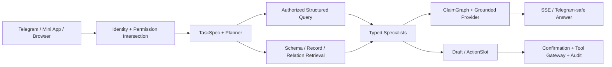

# GitHub Repository Governance And Technical README Implementation Plan

> **For agentic workers:** REQUIRED SUB-SKILL: Use superpowers:subagent-driven-development (recommended) or superpowers:executing-plans to implement this plan task-by-task. Steps use checkbox (`- [ ]`) syntax for tracking.

**Goal:** Make the latest Stage12 source the discoverable GitHub default while giving technical readers an accurate root README and preserving all historical branches and acceptance boundaries.

**Architecture:** Documentation is implemented first and verified on `codex/stage09-ai-conversation-sse`. GitHub governance then promotes the exact documentation commit to `main`, updates metadata, applies non-destructive protection, records the resulting state, and closes the obsolete Draft PR only after every prerequisite succeeds.

**Tech Stack:** Markdown, Git, GitHub CLI/API, PowerShell, Python 3.12+, FastAPI, PostgreSQL/pgvector, Redis, LangGraph, React/Vite/TypeScript

**Spec:** `docs/superpowers/specs/2026-08-25-github-repository-governance-design.md`

## Global Constraints

- Work only from `codex/stage09-ai-conversation-sse`; do not merge unrelated local `codex/stage07-mini-app-ui` commits.
- Never stage `.release-stage12-r80`, `.release-stage12-r81`, `.release-stage12-r81-rejected-incomplete`, `.tmp`, `backend/.tmp`, credentials or generated build output.
- Do not delete, rename, squash, rebase or force-push any existing branch.
- `main` must point to the exact verified documentation commit before it becomes default.
- Latest source must never be described as deployed source, active runtime authority or final Stage12 acceptance.
- Stage12 status must remain: source implemented, runtime default `off`, production answer authority Stage11, deployed P2/P3/Telegram/rollback gates pending.
- GitHub protection must disable force-push and deletion without inventing unavailable CI requirements.
- Pull request #1 may be closed only after `main` is default, protected and contains the final repository documentation.
- No homepage URL may be configured without a fresh reachable public-product verification.

---

### Task 1: Durable Repository Governance Policy

**Files:**

- Create: `project-docs/00-governance/REPOSITORY_GOVERNANCE.md`
- Modify: `project-docs/README.md`

**Interfaces:**

- Consumes: approved branch model and status language from the design spec.
- Produces: the durable policy linked by the root README and project-document index.

- [ ] **Step 1: Write the governance document**

Create `project-docs/00-governance/REPOSITORY_GOVERNANCE.md` with these exact sections and decisions:

```markdown
# Repository Governance

## Status

- Status: approved; activation pending
- Scope: GitHub default branch, feature branches, historical stage branches, pull requests and repository-facing technical documentation
- Current default branch before activation: `stage-02-backend`
- Target default branch: `main`
- Current integrated source: Stage12 present, default-off and not finally accepted

## Branch Model

- `main`: current integrated source and technical documentation.
- `codex/*`: bounded feature or stage development.
- historical stage branches: retained immutable evidence; not normal development targets.

## Pull Requests

Use a focused `codex/*` head and `main` base. A PR must describe scope, verification, skipped tests, remaining risks and external writes. Draft PRs may not be treated as accepted releases.

## Protection And History

Force-push, deletion and history rewrite of `main` are prohibited. Historical branches are retained unless a separately approved cleanup records exact targets and recovery evidence.

## Source And Runtime Status

`latest source != deployed source != active runtime authority != final acceptance`

Stage12 source is present in `main`, but `STAGE12_RUNTIME_MODE` defaults to `off`. Stage11 remains production answer authority until deployed public-path P2, the single P3, bounded Telegram proof and rollback/forward-recovery evidence pass.

## Repository Documentation

The root `README.md` is the technical entry point. `AGENTS.md` and the ordered project truth documents govern implementation. Historical stage documents remain evidence and may not override current source-of-truth documents.
```

Expand each section only with approved details from the spec; include no environment values, server identifiers or production claims.

- [ ] **Step 2: Link the policy from the project document index**

Add `00-governance/REPOSITORY_GOVERNANCE.md` to the governance section of `project-docs/README.md`. Preserve the file's existing language and ordering style.

- [ ] **Step 3: Validate the governance document**

Run:

```powershell
rg -n 'T[B]D|T[O]DO|latest.*accepted|Stage12.*production complete|force.push.*allowed' project-docs/00-governance/REPOSITORY_GOVERNANCE.md project-docs/README.md
git diff --check -- project-docs/00-governance/REPOSITORY_GOVERNANCE.md project-docs/README.md
```

Expected: no placeholder or false-status match; `git diff --check` exits zero. A line describing force-push as prohibited is acceptable and must be reviewed manually rather than removed.

- [ ] **Step 4: Commit the governance policy**

```powershell
git add -- project-docs/00-governance/REPOSITORY_GOVERNANCE.md project-docs/README.md
git diff --cached --check
git commit -m "docs: define repository governance"
```

Expected: exactly the two approved files are committed.

---

### Task 2: Technical Root README

**Files:**

- Create: `README.md`

**Interfaces:**

- Consumes: `AGENTS.md`, `backend/pyproject.toml`, `mini-app/package.json`, Stage12 architecture/audit documents and Task 1 governance policy.
- Produces: the GitHub landing-page contract for engineers.

- [ ] **Step 1: Write product status and architecture sections**

Create `README.md` in Chinese with stable English names. Start with:

```markdown
# Telegram 多维表格与工作智能体

Telegram-first 的多维表格、无代码工作区与表格绑定 Digital Employee 平台。

> **Current Status**
> 最新集成源码包含 Stage12 Quality Architecture V2，但 Stage12 runtime 默认 `off`，尚未完成部署后 P2/P3、Telegram 与回滚验收。当前生产回答权威仍是 Stage11；“默认分支最新”不代表“生产验收完成”。
```

Add product capabilities, the architecture principle and this Mermaid diagram:



State this invariant verbatim:

```text
表格事实由结构化查询引擎计算；Embedding 负责发现候选；LLM 负责理解歧义、分析和表达；Agent 负责协调；Tool Gateway 负责受控落地。
```

- [ ] **Step 2: Add stack and repository map**

Document the confirmed stack from `AGENTS.md` and explain these exact paths:

```text
backend/                    FastAPI, SQLAlchemy, LangGraph, workers and tests
mini-app/                   React/Vite Telegram Mini App and browser UI
deploy/stage09-native/      Native systemd/Nginx/PostgreSQL/Redis release assets
project-docs/               Product, architecture, governance and acceptance truth
docs/superpowers/           Approved designs and executable implementation plans
postgresql/ redis/ systemd/ Native infrastructure assets
scripts/                    Repository-level verification helpers
```

- [ ] **Step 3: Add safe local-development commands**

Include commands derived from actual repository manifests:

```powershell
# Backend
cd backend
python -m venv .venv
.\.venv\Scripts\Activate.ps1
python -m pip install -e .
Copy-Item .env.example .env
python -m alembic upgrade head
python -m uvicorn app.main:app --reload

# Backend verification
python -m pytest -q
python -m alembic current
python -m alembic heads
```

For POSIX environments, add the equivalent activation command `source .venv/bin/activate` without duplicating the full sequence.

Include Mini App commands:

```powershell
cd mini-app
npm ci
npm run dev
npm run test:run
npm run build
```

State that `.env` is ignored, `.env.example` contains names/placeholders only, and secrets must never be committed.

- [ ] **Step 4: Add deployment, evidence, security and documentation sections**

Document native deployment only; explicitly say new Compose/container deployment is not the approved production shape. Link these exact files:

```text
project-docs/08-implementation/STAGE_09_NATIVE_SERVER_DEPLOYMENT_PLAN.md
project-docs/08-implementation/STAGE_09_PRODUCTION_READINESS_AND_DEPLOYMENT_PLAN.md
deploy/stage09-native/scripts/verify-release-layout.sh
deploy/stage09-native/scripts/verify-activation-readiness.sh
```

Record the dated 2026-08-01 local evidence exactly:

```text
Backend: 2595 passed, 40 classified skips
PostgreSQL/pgvector explicit run: 30 passed
Mini App: 79 files / 415 passed
Production build: 1853 modules transformed
Alembic current/head: 20260730_0039
```

Immediately state that these are historical local-candidate results, not a fresh 2026-08-25 rerun and not deployed-path acceptance.

Link:

```text
AGENTS.md
project-docs/README.md
project-docs/00-governance/REPOSITORY_GOVERNANCE.md
project-docs/02-architecture/stage12-quality-v2/README.md
project-docs/08-implementation/STAGE_12_COMPREHENSIVE_ARCHITECTURE_AUDIT.md
docs/superpowers/plans/2026-08-01-stage12-isolated-runtime-wiring.md
```

Add the permission intersection, field visibility, draft-confirmation, audit, raw-credential and retained-evidence security boundaries from `AGENTS.md`.

- [ ] **Step 5: Validate README paths, claims and commands**

Run this link-target validator from the repository root:

```powershell
@'
import re
from pathlib import Path

root = Path.cwd()
text = (root / "README.md").read_text(encoding="utf-8")
missing = []
for target in re.findall(r"\[[^]]+\]\(([^)]+)\)", text):
    if "://" in target or target.startswith("#"):
        continue
    path = target.split("#", 1)[0]
    if path and not (root / path).exists():
        missing.append(path)
if missing:
    raise SystemExit("missing README targets: " + ", ".join(sorted(set(missing))))
print("readme-links: pass")
'@ | python -
```

Then run:

```powershell
rg -n 'password\s*=|api[_-]?key\s*=|token\s*=|C:\\Users\\|production complete|Stage12.*accepted' README.md
git diff --check -- README.md
```

Expected: link validator prints `readme-links: pass`; secret/path/false-status scan has no unsafe hit; diff check exits zero.

- [ ] **Step 6: Commit the root README**

```powershell
git add -- README.md
git diff --cached --check
git commit -m "docs: add technical repository README"
```

Expected: exactly `README.md` is committed.

---

### Task 3: Documentation Verification And Publication

**Files:**

- Verify: `README.md`
- Verify: `project-docs/README.md`
- Verify: `project-docs/00-governance/REPOSITORY_GOVERNANCE.md`

**Interfaces:**

- Consumes: Tasks 1–2 documentation commits.
- Produces: one exact pushed commit suitable for initial `main` creation.

- [ ] **Step 1: Audit the complete tracked delta**

```powershell
git status --short
git diff origin/codex/stage09-ai-conversation-sse...HEAD --stat
git diff origin/codex/stage09-ai-conversation-sse...HEAD -- README.md project-docs/README.md project-docs/00-governance/REPOSITORY_GOVERNANCE.md
git diff --check origin/codex/stage09-ai-conversation-sse...HEAD
```

Expected: only the approved documentation commits differ. Untracked release directories may remain visible but are not staged.

- [ ] **Step 2: Verify repository commands against manifests**

```powershell
rg -n 'requires-python|fastapi|langgraph|pgvector|redis|sqlalchemy|uvicorn' backend/pyproject.toml
rg -n '"dev"|"build"|"test:run"' mini-app/package.json
Test-Path backend/.env.example
Test-Path mini-app/package-lock.json
```

Expected: every README prerequisite and command has a corresponding manifest or file.

- [ ] **Step 3: Push the documentation branch and record the exact commit**

```powershell
git push origin codex/stage09-ai-conversation-sse
git fetch origin
$documentationCommit = git rev-parse HEAD
$remoteCommit = git rev-parse origin/codex/stage09-ai-conversation-sse
if ($documentationCommit -ne $remoteCommit) { throw "documentation branch mismatch" }
$documentationCommit
```

Expected: local and remote commit hashes are identical.

---

### Task 4: Create And Promote `main`

**Files:**

- External GitHub state: remote `main`, default branch, repository description and topics

**Interfaces:**

- Consumes: exact verified `$documentationCommit` from Task 3.
- Produces: discoverable GitHub landing page on `main` without deleting history.

- [ ] **Step 1: Record the pre-change GitHub state**

```powershell
gh repo view jiangylin5-hue/telegram-bitable-work-agent --json defaultBranchRef,description,homepageUrl,url
gh api repos/jiangylin5-hue/telegram-bitable-work-agent/branches?per_page=100 --jq '.[].name'
```

Expected: default branch is `stage-02-backend`; preserve the returned branch-name list for final comparison.

- [ ] **Step 2: Create remote `main` at the exact documentation commit**

```powershell
$documentationCommit = git rev-parse HEAD
git push origin "$documentationCommit`:refs/heads/main"
git fetch origin main
$mainCommit = git rev-parse origin/main
if ($mainCommit -ne $documentationCommit) { throw "main commit mismatch" }
```

Expected: `origin/main` equals the documentation commit byte-for-byte.

- [ ] **Step 3: Change the default branch**

```powershell
gh repo edit jiangylin5-hue/telegram-bitable-work-agent --default-branch main
gh repo view jiangylin5-hue/telegram-bitable-work-agent --json defaultBranchRef --jq '.defaultBranchRef.name'
```

Expected: output is exactly `main`. If it is not, stop before metadata, protection or PR actions.

- [ ] **Step 4: Set repository description and topics**

```powershell
gh repo edit jiangylin5-hue/telegram-bitable-work-agent --description "Telegram-first 多维表格、无代码工作区与表格绑定 Digital Employee 平台"

$topics = @{
  names = @(
    'telegram', 'multidimensional-table', 'no-code', 'fastapi',
    'postgresql', 'pgvector', 'redis', 'langgraph', 'react',
    'ai-agents', 'vite', 'typescript'
  )
} | ConvertTo-Json -Compress
$topics | gh api --method PUT -H 'Accept: application/vnd.github+json' repos/jiangylin5-hue/telegram-bitable-work-agent/topics --input -
```

Expected: description is non-empty and all 12 topics are returned. Do not set `homepageUrl`.

---

### Task 5: Protect `main`

**Files:**

- External GitHub state: branch protection for `main`

**Interfaces:**

- Consumes: verified default `main` from Task 4.
- Produces: no-force-push/no-deletion protection without fictitious CI requirements.

- [ ] **Step 1: Apply minimal non-destructive protection**

```powershell
$protection = @{
  required_status_checks = $null
  enforce_admins = $false
  required_pull_request_reviews = $null
  restrictions = $null
  required_conversation_resolution = $false
  allow_force_pushes = $false
  allow_deletions = $false
  block_creations = $false
  lock_branch = $false
  allow_fork_syncing = $true
} | ConvertTo-Json -Compress

$protection | gh api --method PUT -H 'Accept: application/vnd.github+json' repos/jiangylin5-hue/telegram-bitable-work-agent/branches/main/protection --input -
```

Expected: API succeeds. If the repository plan does not support classic branch protection, stop and report `main` as unprotected; do not pretend the gate passed and do not close PR #1.

- [ ] **Step 2: Verify protection semantics**

```powershell
gh api repos/jiangylin5-hue/telegram-bitable-work-agent/branches/main/protection --jq '{force_pushes: .allow_force_pushes.enabled, deletions: .allow_deletions.enabled, required_checks: .required_status_checks}'
```

Expected:

```json
{"force_pushes":false,"deletions":false,"required_checks":null}
```

---

### Task 6: Record Final Governance State And Close Obsolete PR

**Files:**

- Modify: `project-docs/00-governance/REPOSITORY_GOVERNANCE.md`
- External GitHub state: `main`, PR #1

**Interfaces:**

- Consumes: verified default branch, metadata, topics and protection from Tasks 4–5.
- Produces: durable status evidence, final `main` commit and a clean PR list.

- [ ] **Step 1: Update the governance status with actual evidence**

Change the governance document Status block only after the external checks pass:

```markdown
- Status: active and implemented
- Default branch: `main`
- Protection: force-push disabled; deletion disabled; no required status checks until CI exists
- Historical branches: retained
- Superseded pull request: #1
```

Add a dated `Current Progress` entry with the exact pre- and post-change default branch names and the final `main` commit hash. Do not paste API tokens, URLs containing credentials or full GitHub API responses.

- [ ] **Step 2: Validate and commit the evidence update**

```powershell
git diff --check -- project-docs/00-governance/REPOSITORY_GOVERNANCE.md
git add -- project-docs/00-governance/REPOSITORY_GOVERNANCE.md
git diff --cached --check
git commit -m "docs: record repository governance activation"
```

Expected: exactly one governance document is committed.

- [ ] **Step 3: Push the final commit to both development branch and `main`**

```powershell
git push origin codex/stage09-ai-conversation-sse
$finalCommit = git rev-parse HEAD
git push origin "$finalCommit`:refs/heads/main"
git fetch origin
if ((git rev-parse origin/main) -ne $finalCommit) { throw "final main mismatch" }
if ((git rev-parse origin/codex/stage09-ai-conversation-sse) -ne $finalCommit) { throw "final source branch mismatch" }
```

Expected: both branches resolve to the same final documentation commit.

- [ ] **Step 4: Comment on and close PR #1 as superseded**

```powershell
$finalCommit = git rev-parse HEAD
$body = "Repository governance was completed through the approved non-destructive main promotion. The latest integrated source and technical README are now on main at commit $finalCommit. Historical branches remain retained; this Draft PR is closed as superseded, not merged as a production-acceptance claim."
gh pr comment 1 --repo jiangylin5-hue/telegram-bitable-work-agent --body $body
gh pr close 1 --repo jiangylin5-hue/telegram-bitable-work-agent
```

Expected: PR #1 state is `CLOSED`. Do not delete its source branch.

- [ ] **Step 5: Run final GitHub acceptance**

```powershell
gh repo view jiangylin5-hue/telegram-bitable-work-agent --json defaultBranchRef,description,homepageUrl,url --jq '{default: .defaultBranchRef.name, description, homepage: .homepageUrl}'
gh api repos/jiangylin5-hue/telegram-bitable-work-agent/topics --jq '.names'
gh api repos/jiangylin5-hue/telegram-bitable-work-agent/branches/main/protection --jq '{force_pushes: .allow_force_pushes.enabled, deletions: .allow_deletions.enabled}'
gh pr view 1 --repo jiangylin5-hue/telegram-bitable-work-agent --json state,headRefName,baseRefName,url
gh api repos/jiangylin5-hue/telegram-bitable-work-agent/readme --jq '{path, html_url}'
gh api repos/jiangylin5-hue/telegram-bitable-work-agent/branches?per_page=100 --jq '.[].name'
git status --short --branch
```

Require all of the following:

- default is `main`;
- description matches Task 4;
- homepage remains empty unless separately verified and approved;
- force-push and deletion are false;
- PR #1 is closed;
- the README API resolves `README.md` from the default branch;
- all six pre-change remote branches still exist, plus `main`;
- tracked worktree is clean;
- only the already documented untracked release/temp paths remain.

---

## Final Handoff

Report:

- changed files;
- documentation commit hashes;
- final `main` hash;
- default branch and protection state;
- repository description and topics;
- PR #1 final state;
- preserved historical branches;
- validation commands and results;
- skipped checks;
- untracked temporary release directories;
- remaining risk that Stage12 deployed P2/P3, Telegram and rollback acceptance is still open.
