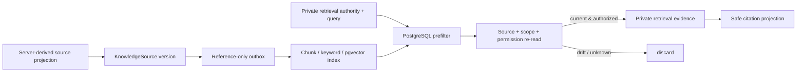

# Stage08 Package D：RAG 与 pgvector 索引设计

## Status

- Scope：为稳定知识投影和已授权 Memory 提供可重建、可撤销、权限双检的 PostgreSQL 混合检索。
- Decision basis：Stage08 已确认 `PostgreSQL + pgvector` 首发、Milvus 非首发、PostgreSQL 为事实与权限真源；详细数据/安全约束以 `STAGE_08_D_RETRIEVAL_DATA_CONTRACT.md` 为准。
- Preconditions：A/B/C 已关闭；本机 native PostgreSQL 无 pgvector extension。Docker Desktop 已启动，专用 disposable pgvector database 仍待创建。

## 1. 设计目标

Package D 解决的是“模型如何在不扩大权限的前提下，从变化中的知识材料中找到当前可引用的片段”，而不是“把所有资料塞进向量库”。

```text
safe source adapter
  -> versioned KnowledgeSource
  -> reference-only index event
  -> chunk / keyword / embedding index
  -> RetrievalProvider prefilter
  -> source + permission re-read
  -> private retrieval evidence + safe citation
```

检索到的文本只存在于当前调用栈，未来由 Package E 合并到 agent context。向量、关键词和 chunk 是可重建的索引材料；业务事实、删除、关系、字段可见性和最终允许读取的判断始终回到 PostgreSQL 现态。

## 2. 方案选择

| 方案 | 结论 | 原因 |
| --- | --- | --- |
| PostgreSQL + pgvector + keyword terms | 采用 | 已确认技术基线；事务、source 生命周期、关系过滤和权限重读可在同一真源完成。 |
| 独立 Milvus 首发 | 不采用 | 需要双写、tombstone、回放、授权回读和运维体系；没有容量/延迟测量依据。 |
| 把全文、完整表格或群历史直接 embedding | 禁止 | 违反最小投影、C2 D1–D6 和字段/群 scope 约束，删除与撤权不可审计。 |
| 当前直接接入真实 embedding provider | 不采用 | 未有模型/profile/成本评测合同；D 先提供受控接口、test adapter 和 fail-closed 运行时降级。 |

## 3. 组成与职责

| 组件 | 职责 | 不负责 |
| --- | --- | --- |
| `KnowledgeSource` lifecycle service | 接受 server-derived safe projection、版本、hash、scope、tombstone | raw 文件上传、任意客户端文本、权限扩大。 |
| `KnowledgeChunker` | canonicalize、稳定切片、keyword terms、chunk hash | 摘要、翻译、模型改写。 |
| `EmbeddingProvider` | 仅内部生成固定 profile 向量 | 读取权限、provider 网络调用（D 首发）。 |
| `KnowledgeIndexWorker` | 锁 source、重读、chunk/index/revoke cleanup、幂等 outbox | 把失败 chunk 当成功、写业务事实。 |
| `PostgresRetrievalProvider` | structured + keyword + vector candidate search，后置重读 | 当权限真源、返回 public IDs。 |
| `RetrievalCitationProjector` | private evidence 映射到安全 display label | 暴露 UUID、字段名、score、正文或 source ref。 |

## 4. 检索流程和安全屏障



预过滤只减少候选，不能允许读取；后置重读才是发放 evidence 的门。任何 source replacement、Memory 失效、field/relation scope 漂移、TTL/revoke/delete 或 embedding profile/hash 不一致，都会丢弃结果而不是退回旧 chunk。

## 5. 数据与生命周期

每次内容变化创建新的 `KnowledgeSource` 版本。旧版本被 `replaced` 后即不可读；worker 可稍后清理正文/embedding，但读路径不等清理完成。一个 source 的索引状态与业务 source 状态不同：source 是可授权的来源；chunk 是可重建索引。二者均要在检索消费时重新检查。

Memory adapter 只从当前 `read_memory_projection(..., read_only)` 的安全结果构造 knowledge projection。document adapter 只接受已有受控文档服务提供的安全投影，当前仓库没有通用文档上传/对象存储，所以 Package D 不会伪造该入口。approved summary 是为 Package E 预留的有来源 versioned source，不在 D 生成。

## 6. 检索质量与预算

- 每次检索最多返回 12 个可验证 chunk，先 overfetch 固定候选、后置授权后补足，不突破 query budget；
- CJK keyword 使用双字 token，Latin/digit 用 normalized term；关键词和 vector 使用固定、可审计的加权，不让模型生成 filter；
- default `UnavailableEmbeddingProvider` 不会静默生成伪向量。只有明确的 `keyword_only` 降级才可运行，并带 internal degradation label；
- test deterministic provider 只验证 hash/profile/dimension、HNSW 和排序合同，不能用作生产语义质量证据；
- Package F 才评估真实 embedding model、召回率、成本、延迟与升级条件。

## 7. 实现顺序

1. 建立严格 contracts、source/chunk lifecycle schema 和 migration preflight；
2. 在 disposable pgvector PostgreSQL 上验证 upgrade/downgrade、extension、GIN/HNSW；
3. 建立 safe source projection、chunker、outbox-driven index/revoke worker；
4. 实现 private authority、Postgres provider、双权限校验与 safe citations；
5. 完成 API management gate、real PostgreSQL lifecycle/concurrency/rebuild 证据和独立复审。

## 8. 不变量

- 检索索引永远可从 PostgreSQL source projection 重建，绝不反向写回权限或业务事实；
- 未授权、删除、撤权、过期、版本不匹配的 source 不产生文本、citation、ID 或错误细节；
- no raw group history / `Message` fields / provider prompt-response / hidden fields in RAG；
- Package D 不调用外部 provider，不发 Telegram，不新增任意文件上传；
- Milvus 仍未安装、未引入、未作为 fallback。

## 9. 验收与环境风险

Package D 必须以 real disposable pgvector PostgreSQL 证明 D-01 至 D-04；SQLite、in-memory UoW 或 unit mock 只能补充、不能替代 extension/HNSW/lifecycle evidence。当前环境风险是 native PostgreSQL 18 缺少 pgvector，必须让测试指向专用 Docker pgvector container。这个 container 不是 staging/production，也不能消除默认 `DATABASE_URL` 的迁移孤儿风险。
