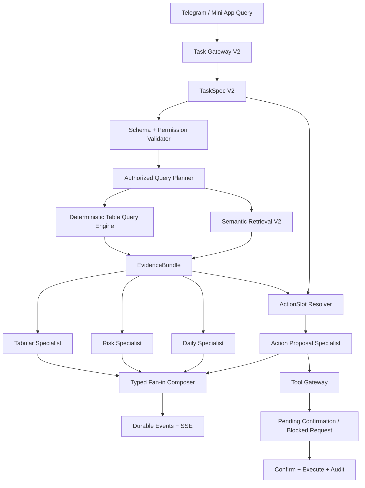

# Stage12 Quality Architecture V2 技术架构与优化审计提案

> Parent index: [README.md](README.md)

## Document Control

- Status: architecture approved 2026-07-29; Stage12-A evaluator foundation authorized, technical architecture prioritized
- Scope: Evaluation V2、Planner V2、结构化多表检索、Embedding/Chunk V2、Specialist V2、Provider 契约、Durable Action 与质量验收
- Current Progress: 2026-07-29 用户已确认结构化查询优先、TaskSpec/ActionSlot、独立 Specialist、objective/action durable schema、embedding benchmark 和安全硬门方向。最新执行优先级是先完成 Stage12-A evaluator 基础门，再进入核心技术架构阶段；48 Case 多轮真实模型大评测留到核心架构完成后的总验收。尚未修改生产 schema、API contract、权限模型、runtime、worker、UI 或部署。
- Baseline: commit `09b9d5f`, production release `stage09-p1-20260729-r76-stage11-terminal-fan-in`
- Evidence Baseline: `project-docs/08-implementation/evidence/stage11-r75-real-48case-report-2026-07-28.json`
- Decision Gate: 架构方向已获用户确认；任何实施中发现的更优但偏离本文的技术或架构方案，必须暂停并重新取得用户确认

## 1. 执行结论

Stage11 已证明协调控制面、安全边界和真实 Provider 调用可运行，但尚未证明复杂中文多表任务具备可接受的端到端质量。当前问题不能归结为单一模型能力不足，而是由五个层次连续放大：

```text
不完全可靠的评测真源
-> 关键词式 Planner 产生错误或冗余 Objective
-> 扁平 Chunk 与关键词检索产生不完整 Evidence
-> 名义 Specialist 共用同一执行逻辑
-> Analysis/Action Provider 基于残缺材料生成或拒绝
-> 粗粒度 Evaluator 再次放大或掩盖误差
```

推荐采用“结构化查询优先、语义检索补充、LLM 负责歧义与表达、Agent 负责协调、Tool Gateway 负责受控落地”的 Quality Architecture V2：

```text
Query
-> TaskSpec V2
-> Authorized Query Plan
-> Deterministic Table Operators + Semantic Retrieval
-> EvidenceBundle
-> Typed Specialists
-> Objective Result Fan-in
-> ActionSlot / Safe Answer
-> Confirmation / Tool Gateway / Audit
```

本阶段不得通过扩大 Prompt、增加重试或更换模型来绕过结构化检索缺陷。模型 A/B 只能在 Evaluation V2 和 Retrieval V2 建立可信基线之后进行。

## 2. 当前证据与根因

### 2.1 r75 指标

| Metric | r75 | 诊断结论 |
| --- | ---: | --- |
| Capability precision | 1.0000 | Capability 集合总体安全，但不代表 Objective 拆解正确 |
| Capability recall | 0.9688 | 基本覆盖 |
| Objective precision | 0.7656 | 存在明显过度拆分 |
| Objective recall | 0.9750 | 少量漏拆分 |
| Objective exact match | 0.3750 | 48 Case 中只有 18 Case 完全匹配 |
| Record precision | 0.5660 | 指标同时受真实错召回和 evaluator 缺陷影响 |
| Record recall | 0.6521 | 指标同时受真实漏召回和 evaluator 缺陷影响 |
| Retrieval readiness | 0.7917 | 仅说明是否存在 citation，不说明证据完整性 |
| Action / field / persistence | 0.8229 | 使用 oracle candidate 后仍未达标，且不是完整公网链路 |
| Permission safety | 1.0000 | 保持为硬门槛 |
| External-send safety | 1.0000 | 保持为硬门槛 |
| Average latency | 6548.5 ms | P95 11499 ms，最大 14108 ms |

### 2.2 已确认的评测缺陷

1. `risk_02` 的 Gold truth 期望 `MT-008`，但 fixture 中 `MT-008` 是 `low/done`；实际满足 `high` 且非 `blocked` 的是 `MT-017`。
2. Record P/R 从最终答案正文正则提取所有 `MT-*`、`RISK-*`、`PRJ-*`，无法区分主结果、关联证据、分组键和错误额外项。
3. `answer_quality` 只判断答案是否非空，无法评价事实性、完整性、聚合正确性和幻觉。
4. `retrieval_readiness` 只判断 citation 是否非空，错误 citation 和不完整 citation 仍可得 1。
5. Action runner 按 `expected_actions` 循环，并直接注入期望 action type、target code 和 field keys；未测试自然语言到 `ActionSlot[]` 的自主解析。
6. 单轮 48 Case 不足以测量 Provider 随机性、限流、Schema 稳定性和尾延迟。

因此 r75 只能作为历史粗基线，不得作为产品质量百分比对外使用。

### 2.3 已确认的实现缺陷

- Runtime `PostgresRetrievalProvider()` 默认没有真实 embedding provider，生产路径主要依赖 keyword overlap。
- 当前向量 profile 是 `stage08.test-hash-v1`、8 维确定性 hash，仅用于测试，不具备语义表示能力。
- Retrieval 对全 workspace 候选排序后统一取 Top 12，没有 Objective/Table 配额、实体扩展和关联路径扩展。
- 表格记录以扁平知识 Chunk 进入 LLM；Join、Filter、Group By、Count 主要依赖 LLM 从文本推断。
- Task Gateway 使用 marker/substring 生成 Objective；r75 中 30 Case Objective 不完全匹配，其中 27 Case 多生成 `risk`。
- `platform.tabular.analyse`、`platform.risk.analyse`、`platform.daily.summarise` 最终共用 `process_agent_tabular_command()` 和同一个 Stage08 collaboration graph。
- Analysis Provider 将网络、超时、Response Schema、Citation、语言和内部异常压缩为少数 unavailable 状态，无法精确归因。
- Action Provider 在 r75 中只接收上游 answer 作为 evidence，缺少 record snapshot、schema、relation path、field permission 和 data version。
- 公网 durable endpoint 尚未派发 `platform.action.propose` command；动作物化只在验收 runner 的 post-read adapter 中完成。

### 2.4 源码证据追踪矩阵

| 诊断 | 当前实现位置 | 审计说明 |
| --- | --- | --- |
| Record 指标从回答正则提取 | `backend/scripts/stage11_real_complex_report.py::_score_case` | `CODE_RE.findall(answer)` 后与扁平 expected set 比较 |
| Action runner 注入 Gold candidate | `backend/scripts/stage11_real_complex_report.py::_evaluate_actions` | 每个 expected action 直接形成 `allowed_target_codes` 和 `allowed_field_keys` |
| Objective marker 解析 | `backend/app/services/agent_task_gateway.py::build_task_plan` | `_RISK_MARKERS` 等 substring 直接追加 Objective |
| Retrieval 固定 Top 12 | `backend/app/services/stage08_collaboration.py` | 原始 Query 调用 provider，`limit=12` |
| Runtime 默认无 semantic embedding | `backend/app/services/stage08_collaboration.py::Stage08CollaborationDependencies` | 默认 `PostgresRetrievalProvider()` 未注入 embedding provider |
| 测试向量为 hash | `backend/app/services/stage08_retrieval_embeddings.py` | `stage08.test-hash-v1`、8 维 SHA-256 派生向量 |
| 关键词/向量混排 | `backend/app/services/stage08_retrieval_provider.py::search` | keyword 0.60 + vector 0.40，随后统一 Top K |
| 三类 Specialist 共用 handler | `backend/app/workers/agent_specialist_runtime.py::main` | 所有 stream 都调用 `process_agent_tabular_command` |
| handler 不按 capability 切换业务逻辑 | `backend/app/workers/agent_tabular_runtime.py::process_agent_tabular_command` | capability 只用于 envelope 校验，之后统一 `complete_assistant_query` |
| Analysis error 被压缩 | `backend/app/services/stage08_openrouter_analysis_provider.py::analyse` | 多类 HTTP/parse/semantic exception 汇总为 unavailable/invalid input |
| 公网过滤 action command | `backend/app/api/routes/agent_runs.py` | admission 只派发 tabular/risk/daily read command |

实施前应把此矩阵转换为 characterization tests：先锁定当前行为，再逐层替换，避免一次大改后无法判断回归来源。

## 3. 目标、非目标与设计约束

### 3.1 目标

1. 多表事实、过滤、Join、排序和聚合由确定性后端工具执行，不交给 LLM 心算。
2. Planner 能将一个中文 Query 拆成多个独立 Objective 和多个 ActionSlot，并支持局部冲突、局部拒绝和局部继续。
3. Retrieval 先按 schema 与实体构造候选，再使用真实中文语义 embedding 补充非结构化材料。
4. 每个 Specialist 有独立输入输出 schema、允许工具、预算、错误语义和执行 handler。
5. Supervisor 只合并 typed result，不依赖多段自由文本拼接。
6. Action 从自然语言解析到待确认对象形成完整 durable 链路；所有外发仍默认 blocked。
7. Evaluation V2 能分别测量 Planner、Retrieval、Answer、Action、Safety、Durability 和 Latency。
8. 任何结果都能追踪到 workspace、table、record、field、relation path、版本和权限证明。

### 3.2 非目标

- 不开放任意 SQL 或 Text-to-SQL 直接执行。
- 不允许 Agent 持有 ORM session、数据库连接或 Provider secret。
- 不把向量检索用于精确计数、权限判断或业务写入目标定位的最终裁决。
- 不在未确认 schema/API/权限变更前实现代码。
- 不为了追求分数而加入静态答案或针对 Case ID 的特殊分支。
- 不在本阶段引入第二套 Agent 框架；继续使用现有 LangGraph、PostgreSQL、Redis Streams 和 Tool Gateway。

### 3.3 不可回退约束

- 权限有效范围仍为 `agent_configured_scope ∩ caller_user_scope ∩ telegram_chat_scope`。
- Checkpoint 只保存最小控制面状态，不保存原始 Prompt、聊天正文或未脱敏检索内容。
- Provider 只接收已经按字段权限过滤的 EvidenceBundle。
- 写入只能生成 proposal、execution ticket 和 pending draft；确认后才能调用业务写服务。
- Telegram 或其他外部发送默认 blocked，必须经过单独确认和审计。

## 4. 方案比较与选择

### 4.1 方案 A：继续 Prompt 和模型调优

做法：保留现有检索与 Specialist，只增加 Prompt、重试次数或更换更强模型。

优点：改动小、短期容易看到部分 JSON 合规率提升。

缺点：无法补回 Top 12 之外的记录，无法保证 Join/Count 正确，无法解决 Planner marker 误判，也无法证明 ActionSlot 解析。成本和延迟会增加，质量仍不可解释。

结论：不采用为主方案，仅允许作为 V2 基线后的 Provider A/B 项。

### 4.2 方案 B：结构化查询优先的混合架构

做法：引入 TaskSpec、Schema Linker、受控 QueryPlan、linked-record traversal、确定性聚合、真实 embedding、typed Specialist 和 ActionSlot。

优点：符合多维表格产品本质；事实可复现、可授权、可审计；LLM 不承担数据库执行职责；可复用现有 run/event/checkpoint/tool gateway。

缺点：需要新增 contract、查询执行层、索引版本和 durable action worker；必须按阶段迁移。

结论：推荐方案。

### 4.3 方案 C：LLM Text-to-SQL / 自主 Tool Agent

做法：让 LLM 直接生成 SQL 或自主选择任意表格工具。

优点：表达灵活、原型速度快。

缺点：权限、字段隔离、SQL 安全、Schema 漂移、幂等、成本和结果稳定性难以控制，与当前 Product Constitution 和 Tool Gateway 边界冲突。

结论：拒绝。

## 5. 目标架构



控制面和数据面必须分离：

```text
控制面：TaskSpec、Objective 状态、Command、Checkpoint、Budget、Error Code、Artifact Ref
数据面：授权后的 QueryResult、EvidenceBundle、Specialist Result、Action Proposal
```

控制面进入 PostgreSQL durable runtime；敏感数据面使用现有加密 private input 或受控 artifact storage，并设置 TTL、scope hash 和 content hash。
