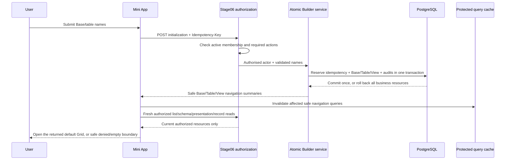

# Stage 07 P3: Base/Table Atomic Builder Design

## Status

- Document status: user-approved design specification; implementation waits for this document's review and a separate implementation-plan approval
- Scope: Stage07 Package 2, the first Builder substage: create a blank Base with its first table, or create a table in an existing Base
- Current Progress: 2026-07-10 design written after user confirmation of atomic creation, server-generated table keys and the default Grid rule; no business code, migration or UI contract has been changed by this document
- Decision boundary: introduces a narrowly scoped API, PostgreSQL index and frontend mutation flow. It does not authorize field, view, rename, delete, import/template, governance, Bot or draft work.
- Source alignment: `AGENTS.md` §§1–10; `STAGE_07_SOURCE_OF_TRUTH.md` §§4–7; `STAGE_07_SDD.md`; `modules/STAGE_07_BITABLE_WORK_SURFACE.md`; `STAGE_07_BDD_AND_ACCEPTANCE.md`; `STAGE_07_API_DATA_SECURITY_CONTRACT.md`; `STAGE_07_REQUIREMENT_TRACEABILITY_AUDIT.md` Package 2.

## 1. Purpose

Stage06 already creates Bases, tables and views through three primitive, independently committed endpoints. Those endpoints are deliberately retained for backend, template and later admin use, but a Mini App must not chain them from the browser: a network or permission failure between requests can leave an unusable Base or table with no saved view.

This substage adds two user-facing, server-owned creation flows:

```text
New Base        -> Base + first Table + one default Grid view -> open that Grid
New Table       -> Table + one default Grid view              -> open that Grid
```

The user supplies names, not internal identifiers or view policy. The backend owns authorization, table-key generation, default-view invariants, audit and atomic persistence. The browser receives only the safe resource summaries needed to navigate to the newly created canvas.

## 2. Product Scope And Non-Goals

### 2.1 In scope

1. A desktop and mobile entry to create a blank Base from Workspace Home when the server reports the existing `can_manage_schema` capability.
2. A desktop and mobile entry to create a blank table in an already open Base under the same display hint.
3. An atomic server operation for each entry, with idempotent retry/replay.
4. One new active Grid view named `所有记录`, marked as the only default view for the newly created table.
5. Server-generated, non-user-facing table keys.
6. Safe post-create navigation through the returned resource identifiers and a fresh authorized navigation read.
7. Audit records, permission denial, duplicate-click protection, unit/integration/browser evidence and documentation updates.

### 2.2 Explicitly out of scope

- creating, editing, reordering, deleting or hiding fields;
- creating additional views, configuring filters/sorts/groups, changing view policies or changing the default view later;
- Base/table rename, duplication, archival, deletion, move or copy operations;
- templates, imports, record insertion, schema/permission administration, Bot contacts, drafts and Telegram external actions;
- client-created keys, client-provided raw view configuration or client-provided permission policies;
- “helpful” automatic first fields such as `名称`. A newly created table has zero fields by design; the next Field Builder substage owns field creation.

The first empty Grid may show a contextual, non-mutating empty state that explains that fields must be added before records are meaningful. It must not display an inert `添加字段` control or pretend that the Field Builder is already available.

## 3. Mature Pattern Reuse And Licensing Boundary

The interaction follows the established Base → Table → View resource hierarchy shared by mature open-source no-code products. Teable documents a spreadsheet-oriented data surface with multiple views, while NocoDB documents separate table, column and view operations; Baserow follows the same database/table/view product grammar. These are architecture and UX references only, not copied source code.

| Reference | Reused principle | Deliberately not copied |
| --- | --- | --- |
| [Teable](https://github.com/teableio/teable) | A table is opened through a view-oriented work surface; different view types are distinct resources. | Source code, component names, styling, data structures and AGPL-licensed implementation. |
| [NocoDB](https://github.com/nocodb/nocodb) | Table/field/view operations are separate authorities; unavailable creation is surfaced as a permission boundary. | Source code, translations, API shapes and GUI implementation. |
| [Baserow](https://github.com/baserow/baserow) | A Base/database contains tables and views; creation is a focused action rather than a client-side reconstruction of metadata. | Source code, API contracts, visual assets and data model. |
| Existing Stage06 template/import services | One UoW creates a resource graph, writes audit, and stores an idempotent response reference. | Browser sequencing of primitive create endpoints; this substage introduces a safer, atomic variant for the Mini App. |

The project-native source of truth remains this repository's Stage06 service, authorization and audit boundary. Third-party repositories are not runtime dependencies and no external code will be copied.

## 4. Confirmed Decisions

| Decision | Chosen rule | Reason |
| --- | --- | --- |
| User workflow | `New Base` creates Base + initial table + initial Grid; `New Table` creates table + initial Grid. | A success destination exists immediately; no half-built user resource. |
| API shape | Two explicit initialization resources, not optional flags on the old primitive endpoints. | Keeps primitive Stage06 API semantics stable and makes the UI operation auditable. |
| Names | Browser submits display names only. Backend generates the table key. | Avoids exposing a technical identifier to ordinary users. |
| Default view | Every newly initialized table gets exactly one active Grid named `所有记录`, `is_default=true`. | The post-create destination is explicit and never guessed from list order. |
| Existing tables | The database permits zero or one default view per table; it does not retroactively choose a default for legacy tables. | Avoids silently altering existing resources while preventing future double-default races. |
| Permissions | Server independently requires all existing actions needed by the graph; UI capability is presentation-only. | A visible button never becomes authority. |
| Transaction | Business resources, audits and completed idempotency reference commit together or roll back together. | A failed request creates no Base/table/view resource and no poisoned retry record. |
| Frontend navigation | Response IDs are hints; the client refetches authorized table/view summaries before opening the returned destination. | A permission change between mutation and render cannot expose unverified state. |
| Scope limit | No automatic field and no other Builder action. | Preserves the approved substage boundary and makes the next Field Builder independently reviewable. |

## 5. Architecture



### 5.1 Server responsibilities

The atomic Builder service is the only place in this substage allowed to assemble the resource graph. It composes existing `create_base`, `create_table` and `create_form_view` domain routines with an initialization-specific wrapper. It must not allow the browser to supply `key`, `config`, `permission_policy`, `is_default`, `status` or an audit payload.

The wrapper creates:

| Flow | Resource | Fixed values |
| --- | --- | --- |
| Base initialization | `BitableBase` | `source_type="blank"`, `status="active"`; display name from request |
| Base/table initialization | `PlatformTable` | display name from request; backend-generated unique `key`; `status="active"` |
| Base/table initialization | `PlatformView` | name `所有记录`; `view_type="grid"`; `config={"fields": []}`; empty policy; `is_default=true`; `status="active"` |

The empty `fields` configuration is an intentional safe representation of a zero-field table. `GET /views/{view_id}/presentation` will continue to derive field visibility from authorized persisted fields rather than trusting this configuration.

### 5.2 Database invariant

`views.is_default` already exists. This substage adds a PostgreSQL partial unique index equivalent to:

```sql
CREATE UNIQUE INDEX uq_views_one_default_per_table
ON views (table_id)
WHERE is_default IS TRUE;
```

It enforces **at most one** default view for each non-null `table_id`; the atomic service enforces **exactly one** for every newly initialized table. The migration must not silently demote legacy data. If an existing database has duplicate `is_default=true` rows, the migration must fail with a clear preflight/remediation note rather than arbitrarily selecting a winner. Current Stage06 creation always writes `is_default=false`, so normal current data is expected to satisfy the index.

The ORM model must declare the same partial index, and the Alembic revision must be linear from the current single head. No new tables or raw JSON policy columns are introduced.

### 5.3 Atomic idempotency rule

Existing template/import code proves the project has request fingerprints, `Stage06IdempotencyRecord`, response references and unique `(workspace_id, operation, idempotency_key)` storage. This substage reuses those types and fingerprint format but uses an initialization-specific atomic reservation routine:

1. validate and authorize before any idempotency record or resource is added;
2. look up the scoped `(workspace, operation, key)` record;
3. replay its stored safe response only when the payload fingerprint matches and it is completed;
4. for a new key, add the idempotency record, Base/Table/View and all audit events to the **same** SQLAlchemy transaction;
5. store the safe response reference as completed, then issue one commit;
6. on validation, authorization, database or view-creation failure, roll back that whole transaction; no Base/Table/View/audit/idempotency record survives;
7. if concurrent identical requests race on the idempotency unique constraint, roll back the loser, reread the winner and replay only its matching completed response. A different fingerprint is a `409` conflict.

This isolates the new UI path from the older template helper's early reservation commit. It does not change the behavior of template/import operations outside this substage.

## 6. API Contract

### 6.1 New Base initialization

```http
POST /workspaces/{workspace_id}/base-initializations
Idempotency-Key: <non-empty client UUID, max 160 chars>
Content-Type: application/json
```

```json
{
  "base_name": "客户运营",
  "table_name": "客户"
}
```

### 6.2 New table initialization

```http
POST /bases/{base_id}/table-initializations
Idempotency-Key: <non-empty client UUID, max 160 chars>
Content-Type: application/json
```

```json
{
  "table_name": "待办"
}
```

### 6.3 Shared safe response

The response is a navigation receipt, not a raw builder schema:

```json
{
  "base": {
    "id": "uuid",
    "name": "客户运营",
    "source_type": "blank",
    "status": "active"
  },
  "table": {
    "id": "uuid",
    "base_id": "uuid",
    "name": "客户",
    "key": "tbl_...",
    "status": "active"
  },
  "default_view": {
    "id": "uuid",
    "base_id": "uuid",
    "table_id": "uuid",
    "name": "所有记录",
    "view_type": "grid",
    "status": "active"
  }
}
```

The Base object intentionally follows the safe `BaseSummary` shape, rather than primitive `BaseResponse`; it excludes Base descriptions/settings. The view object follows `ViewSummaryResponse` and excludes `config`, `permission_policy` and the internal default flag. Its position under `default_view` is the explicit navigation pointer. The response contains no role, capability, field, record, audit, trace, idempotency fingerprint or identity value.

### 6.4 Validation and response codes

| Condition | Result | Browser behavior |
| --- | --- | --- |
| Valid, first submission | `201 Created` plus safe receipt | Invalidate/refetch and open exact receipt destination. |
| Same key, same payload, completed | `200 OK` plus original safe receipt | Treat exactly as success; no duplicate resource. |
| Blank/overlong/invalid display name | `422` safe validation code | Keep drawer values and show inline generic field feedback. |
| No active member / required action missing | `403` generic denial | Clear affected protected workspace scope; do not expose existence details. |
| Unknown Base in table flow | `404` generic unavailable boundary | Do not retry with guessed Base IDs. |
| Same key, different payload | `409` | Disable duplicate submission and ask the user to reopen/retry with a new deliberate action. |
| Network/5xx before receipt | no assumed result | Preserve drawer values and the same generated key for an explicit retry. |

Names are trimmed server-side and must be non-empty after trimming. The first implementation uses `1..160` display characters, matching the existing Base/table name storage. `table_name` is not required from a client to derive a key; the service generates a collision-safe opaque key (`tbl_` plus a server UUID-derived suffix). The generated key remains visible only where the existing safe table summary already exposes it; the creation drawer never asks for or edits it.

### 6.5 Authorization and audit

The mutation display hint remains `WorkspaceCapabilities.can_manage_schema`, but it is never a server authorization input.

| Flow | Required server checks | Audit |
| --- | --- | --- |
| Base initialization | `base.create`, `table.create`, `view.manage` on the requested workspace | existing `stage06.base_created`, `stage06.table_created`, `stage06.view_created`, plus `stage06.base_initialized` parent event with only resource IDs/types/names |
| Table initialization | `table.create`, `view.manage` after Base→workspace ownership resolution | existing `stage06.table_created`, `stage06.view_created`, plus `stage06.table_initialized` parent event with only resource IDs/types/names |

The parent audit event gives a single durable operation boundary without putting raw config, request headers, role strings, table key, policy or hidden data in `after_state`. Audits participate in the same transaction as their resources.

## 7. Desktop And Mobile Interaction Design

### 7.1 Entry visibility

| Surface | Desktop | Mobile | Denied behavior |
| --- | --- | --- | --- |
| Workspace Home | `新建 Base` appears in the Home/Bases action area. | A clearly labelled, touch-sized `新建 Base` action appears in the Home/Bases action area; it is not a hover-only icon. | Omit the action when the active workspace lacks `can_manage_schema`. |
| Open Base Canvas | The existing `新建表` plus control opens the table drawer. | The same control opens the mobile sheet/full-screen editor; no desktop-only hover menu is required. | Omit/disable only by server capability presentation; a stale visible action still receives normal server denial. |

Capability visibility reduces confusion but is intentionally not evidence of privilege. A direct request always receives the endpoint's independent authorization checks.

### 7.2 Reusable creation panel

One focused `BuilderCreatePanel` component has two modes, not a multi-step generic wizard:

| Mode | Required controls | Initial value | Submit label |
| --- | --- | --- | --- |
| `base` | Base name; first table name | first table name `数据表` | `创建 Base` |
| `table` | table name | `数据表` | `创建数据表` |

Panel rules:

1. It opens as a side drawer on normal desktop width and as a full-height focused sheet on narrow mobile width.
2. On open, keyboard focus lands on the first display-name input; close/cancel restores focus to the invoking control.
3. Submission is unavailable for blank trimmed fields, while server validation remains authoritative.
4. It has an explicit close/cancel action. Closing never creates a resource and clears its unsent local input.
5. The submit button shows one pending state and rejects repeated clicks. The generated `Idempotency-Key` is retained only for retrying the same failed submission; a new panel invocation gets a new key.
6. Server errors use concise Chinese product language and no raw exception detail. A `403`/`404` leaves no cached resource preview behind.
7. Success closes the panel only after the authorized navigation re-read has produced the target canvas. If authorization changes in that interval, the panel closes into the existing denied state rather than showing stale success.

### 7.3 Post-create navigation

The receipt is not directly rendered as a trusted canvas. The frontend must:

1. invalidate the current workspace Home Base list; for table creation also invalidate the active Base table/view list;
2. call the existing protected `GET /bases/{base_id}/tables` and `GET /bases/{base_id}/views` under the verified user/workspace key;
3. verify that the returned lists contain the receipt table and default view and that the view belongs to that table;
4. request the normal protected schema, view presentation and first record page; and
5. commit the canvas only if the same workspace/Base/table/view request generation remains current.

No fallback may choose “the first” returned table or view after a creation receipt. If the receipt pointer is no longer readable, the browser follows existing `401`/`403`/`404` safe-state behavior. This prevents a permission revocation or a list-order change from opening an unrelated resource.

### 7.4 Empty-field table state

After a successful initialization the grid has a table, view and zero fields. The renderer must show a precise empty-field state inside the authorized Base Canvas, for example: `此数据表尚未添加字段。字段配置将在 Builder 的下一子阶段提供。` It contains no optimistic record form or nonfunctional field-management action. Existing generic “no accessible table or view” state remains reserved for genuinely missing/denied navigation resources.

## 8. Frontend State And Security Rules

- Add typed `BaseInitializationReceipt` and `TableInitializationReceipt` transport models; do not cast primitive create responses.
- Mutations use the established memory-only protected query client. The request key and all subsequent query keys retain verified `userId` and `workspaceId` scope.
- A creation generation is separate from Base/open, table-switch, create-form and record-detail generations. A late creation receipt cannot reopen an old workspace/Base after the user switches or closes the panel.
- `401` clears all Stage07 protected queries. `403` clears the active workspace scope. `404` removes only the attempted target and renders the generic unavailable boundary. No resource detail is retained for any of these states.
- The browser never persists input names, idempotency keys, receipts or builder cache to `localStorage`, `sessionStorage`, analytics or error telemetry.
- The new request models, endpoint names and response types are explicit. The UI must not call the primitive `POST /workspaces/{id}/bases`, `POST /bases/{id}/tables` or `POST /bases/{id}/views` endpoints for this feature.

## 9. BDD Scenarios

### Scenario P3-1: Authorized Base creation opens its exact default Grid

Given an active Builder has `base.create`, `table.create` and `view.manage` in workspace W,

When the Builder submits a Base name and first-table name with a new idempotency key,

Then one blank active Base, one active table and one active `所有记录` Grid view are committed,

And that view is the table's only `is_default=true` view,

And the client refetches authorized navigation before opening that exact table/view,

And it never receives raw view configuration or policy.

### Scenario P3-2: Authorized table creation does not alter other tables

Given a Builder is on an existing Base with saved tables/views,

When the Builder creates a table,

Then exactly one new table and one new default Grid view are added,

And existing table selection, views, fields and records remain unchanged,

And the client opens only the returned table/view after a fresh authorized list read.

### Scenario P3-3: A duplicate click is idempotent

Given a Builder submitted an initialization request but did not receive the response,

When the same request payload and `Idempotency-Key` is retried,

Then the server returns the original receipt,

And only one Base/table/view graph and one parent initialization audit event exist.

### Scenario P3-4: Denial and partial failure leave no business resource

Given a viewer, non-member, or caller missing one required action submits an initialization request,

When authorization runs,

Then the response is generic denial and no idempotency or business resource is created.

Given a failure occurs after the service starts but before transaction commit,

When the transaction rolls back,

Then no Base/table/view/audit/idempotency record from that attempt is durable.

### Scenario P3-5: Concurrent defaults cannot coexist

Given two concurrent attempts attempt to mark separate views as default for the same table,

When PostgreSQL commits them,

Then the partial unique index permits at most one default view,

And the losing transaction yields a safe conflict/error without changing the existing default.

### Scenario P3-6: Empty initialized table is honest

Given a newly initialized table has no fields,

When its Grid opens on desktop or mobile,

Then the canvas identifies the empty-field condition,

And it does not offer a fake record or field mutation path.

## 10. Test-First Implementation And Evidence

Implementation begins only after this document is reviewed and the companion implementation plan is approved. Every task starts RED, then the smallest GREEN implementation, then focused/full verification.

| Layer | Required RED/GREEN evidence |
| --- | --- |
| Service/domain | Base and table graph composition; server-generated key; default Grid; parent audit; no accidental field; rollback test with an injected view/audit failure. |
| Authorization/API | each required action; viewer/non-member denial; Base ownership resolution; safe response shape excludes raw policy/config; input validation status codes. |
| Idempotency/concurrency | same-key replay; same-key different-payload conflict; concurrent identical request rolls back/replays correctly; PostgreSQL partial unique index blocks a second default. |
| Migration | Alembic upgrade from current head, downgrade/re-upgrade check, ORM metadata/index assertion, existing data preflight behavior. |
| Frontend component | entry visibility, accessible labelled drawer/sheet, trimming/required validation, submit pending, cancel/focus restoration, error text and no desktop-only mobile dependency. |
| Frontend application | exact request/header/payload, retry uses same key, receipt-driven navigation does not fall back to list order, stale workspace/Base response cannot replace active state, `401`/`403` cache clear. |
| Browser QA | disposable local contract fixture on desktop and a genuine narrow viewport/emulator path; New Base and New Table success, validation, denial, retry and zero-field state; inspect console errors and remove fixture/server afterward. |

Full gates before the coherent implementation commit:

```text
backend:  python -m pytest -q
mini-app: npm.cmd test -- --run
mini-app: npm.cmd run build
repo:     git diff --check
database: alembic upgrade head (and a real PostgreSQL migration/index smoke when configured)
```

The verification report must record actual counts, skipped environment-bound tests, browser viewport limitations, fixture cleanup and remaining risks. Passing mocked frontend tests alone is not an acceptance claim.

## 11. Expected Files And Boundaries

| Area | Expected change | Boundary |
| --- | --- | --- |
| `backend/app/schemas/stage06_platform.py` | narrow initialization requests/receipts | no raw policy/config or broad primitive response reuse |
| `backend/app/services/stage06_platform.py` or focused Builder service | atomic graph composition, default-view flag, safe key generation/audit | do not alter unrelated template/import behavior |
| `backend/app/services/stage06_idempotency.py` or focused adapter | atomic scoped reservation/replay helper | no behavior change to existing template/import flow without separate approval |
| `backend/app/api/routes/stage06_platform.py` | two typed routes, independent auth/error mapping | primitive endpoints remain compatible |
| `backend/app/models/stage06_platform.py` and Alembic | partial unique default-view index | no silent legacy-data repair |
| `backend/tests/...` | focused service/API/migration/PostgreSQL regression tests | include negative/rollback cases |
| `mini-app/src/app/api.ts` | typed receipts and mutation transport | no raw primitive builder POSTs |
| `mini-app/src/app/App.tsx` | generation-protected mutation/navigation owner | preserve protected query boundaries |
| `mini-app/src/app/WorkspaceHome.tsx`, `BaseCanvas.tsx`, new panel | capability-gated entry and accessible panel | no field/view/admin scope creep |
| `mini-app/src/styles.css`, frontend tests | responsive sheet/drawer and interaction coverage | retain approved light visual direction |
| Stage07 docs/audit/progress | implementation evidence after verification | do not mark Package 2/Stage07 accepted |

## 12. Acceptance Criteria For This Substage

- [ ] An authorized Builder can create a blank Base plus initial table/default Grid from Workspace Home.
- [ ] An authorized Builder can create a table plus default Grid from an open Base.
- [ ] The browser submits only names; it never submits key/config/policy/default/role data.
- [ ] Every initialized table has exactly one default Grid; PostgreSQL prevents a second default for the same table.
- [ ] A validation, authorization or injected transaction failure leaves no durable partial business resource or poisoned retry record.
- [ ] Same-key retries replay the same safe receipt; different payloads conflict safely.
- [ ] All endpoint responses and browser state exclude raw policy/config, field data, role claims and audit/idempotency internals.
- [ ] Navigation verifies receipt IDs against fresh authorized lists and cannot choose an unrelated “first” resource.
- [ ] Desktop and mobile create flows are keyboard/touch accessible and include loading, validation, denial, retry and zero-field states.
- [ ] Focused RED/GREEN tests, full backend/frontend/build gates, migration checks and disposable browser QA have fresh evidence.
- [ ] Progress/audit documentation distinguishes this bounded Builder slice from unimplemented field/view/import/governance/Bot work.

## 13. Risks And Follow-Up Gates

| Risk | Mitigation in this substage | Follow-up owner/gate |
| --- | --- | --- |
| Existing primitive API exposes raw configuration/policy | UI never calls it; new receipts are safe summaries. | Field/View Builder needs separate safe read/write contract. |
| Default uniqueness only in application code | PostgreSQL partial unique index. | Later default-view switching must be its own transactional decision. |
| Retry produces duplicates | Same-transaction idempotency reference plus conflict/replay tests. | Import/template retain their existing separately tested idempotency behavior. |
| New table feels empty | Honest zero-field state; no false action. | Field Builder substage defines typed field creation and first-field UX. |
| Client capability becomes privilege | Endpoint checks all actions and fresh lists after mutation. | Governance substage defines resource-policy administration. |
| Mobile visual regression | Full-height sheet/touch targets and target-viewport QA. | Real Telegram Mini App evidence remains a Stage07 external gate. |

## 14. Review Gate

This specification is intentionally detailed enough to make implementation reviewable. Before an implementation plan or code is created, the user reviews this document for:

1. the two endpoint/resource names and safe response shape;
2. the one-transaction idempotency behavior;
3. the PostgreSQL default-view uniqueness invariant;
4. the zero-field/no-automatic-first-field boundary; and
5. the desktop/mobile panel and receipt-driven navigation behavior.

No implementation begins until that review is approved.
